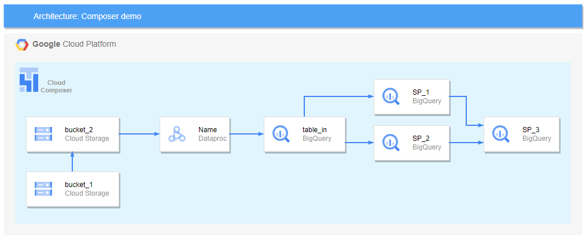

# Proof of concept

Implement architecture for ETL with the following GCP services
- Composer
- GCS
- Dataproc
- Bigquery



## Configure enviroment

Create .env file
```bash
cp .env.sample .env
```

Replace values for GCP information
```
ACCOUNT=<ACCOUNT>
PROJECT=<PROJECT_ID>
```

Download GCP json credential and copy it in `dags/connections/gcp_credentials.json`

Replace required values in the project
```
<ACCOUNT>
<PROJECT_ID>
<BUCKET_1> # input bucket
<BUCKET_2> # temporal bucket
<BUCKET_3> # output bucket
<DATASET> # bigquery dataset
<ENVIRONMENT_NAME> # composer enviroment name
<LOCATION> # composer enviroment location
```

Create required services in gcp.
```bash
sh scripts/gcp_services.sh
```
- Enable composer api
- Create required buckets
- Create bigquery dataset
- Create store procedures required for ETL


## Local execution

Init local airflow
```bash
sh scripts/up.sh
```

Create GCP connection
- Go to http://localhost:8080/
- Click in Admin/Connections in the top menu bar
- Add a new record ➕
- Fill in the fields

  |Name|Value|
  |----|---|
  |Connection id  |`google_cloud_default`
  |Connection Type|`Google Cloud`
  |Project Id     |`<PROJECT_ID>`
  |Keyfile JSON   |`/opt/airflow/dags/connections/gcp_credentials.json`
- Save connection


## GCP execution

Create composer env
```bash
sh scripts/composer_env.sh
```

>When the compositor environment is already created, the output of the script return the variables `COMPOSER_DAGS` and `COMPOSER_URL`. Replace `<COMPOSER_DAGS>` in `scripts/deploy_gcp.sh` file for later deployments in gcp and open `COMPOSER_URL` in your browser.


Copy local dags folder to composer dags folder
```bash
sh scripts/deploy_gcp.sh
```


## Remove deployment

Execute the script for delete local or cloud environment
```bash
sh scripts/down.sh -l      # for local delete
sh scripts/down.sh --local # for local delete
sh scripts/down.sh -c      # for cloud delete
sh scripts/down.sh --cloud # for cloud delete
```
