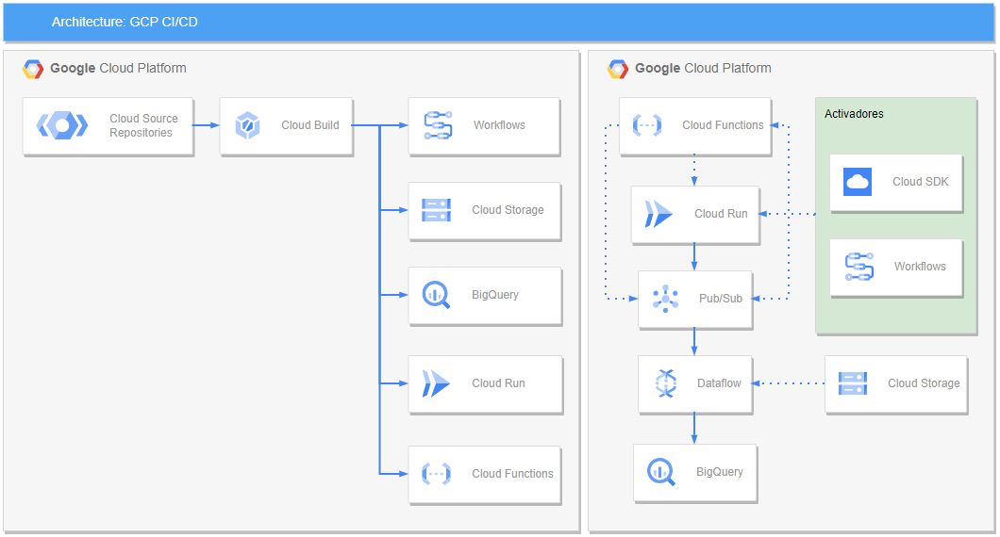

# Google Cloud CI/CD

Proof of concept for event handling with Pub/Sub and Dataflow, generated with Cloud Run and Bigquery as Data Warehouse, with Cloud Functions, Workflows, and Cloud SDK as triggers for test event generation.




## Configure enviroment

Create .env file
```bash
cp .env.sample .env
```

>***Note:*** Open .env file and replace values for GCP information


## Connect Repository
Connecting a repository to Cloud Build in Google Cloud Platform involves the following steps:

1. Open the Cloud Build console in the Google Cloud Platform console.
2. In the menu on the left, select "Source connections".
3. Click on "Add connection".
4. Select the type of repository you want to connect. Cloud Build supports several types of repositories, such as Git, GitHub, Bitbucket, Cloud Source Repositories, and more.
5. Follow the instructions to authenticate your repository account and authorize Cloud Build to access your repositories.
6. Once you have connected your repository, you can create a new Cloud Build trigger that is connected to that repository.


## Getting Started

Execute the following commands to configure project services

```bash
chmod +x scripts/setup.sh
./scripts/setup.sh
```

## Cleaning Up the Environment

Follow these steps to clean up the environment:

```bash
chmod +x scripts/cleanup.sh
./scripts/cleanup.sh
```
