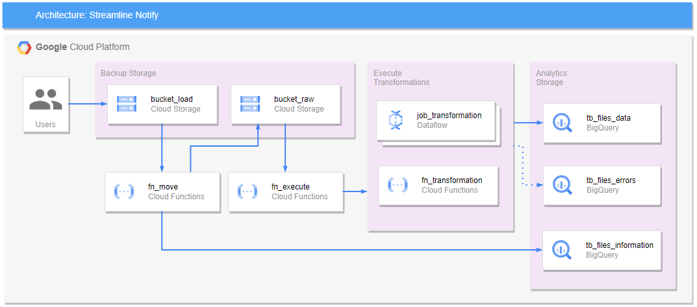

# Streamline Notify: An Event-Driven ETL Pipeline

The project focuses on implementing a cloud-based data processing system for efficiently managing files from multiple users. The main objective is to clean and store the received files using real-time streaming. The system utilizes Google Cloud Platform (GCP) services to achieve this functionality and managed with Terraform for robust architecture

## Steps for File Processing

1. **File Ingestion**: Files are uploaded to a cloud storage bucket (`${BUCKET}_load`) as the entry point of the system. They can originate from multiple users and be in different formats.

2. **File Movement**: To prevent modifications by users, the files are moved to another bucket (`${BUCKET}_raw`) using a unique prefix generated from the insertion date and time. This ensures the integrity of the original files.

3. **Insert File Information into BigQuery**: After the file has been successfully moved, the Cloud Function (`${FUNCTION}_move`) retrieves the file's name and record count. Using the BigQuery client library, the function inserts a new row into the designated BigQuery table (`$INFO_TABLE`).
>You can see the [information table schema](./bigquery/conf_tables.sql#L1-L3)

4. **Dynamic Dispatch**: The file upload to `${BUCKET}_raw` triggers `${FUNCTION}_execute`. This function evaluates the file size (`${FILE_SIZE}`) to determine the appropriate processing method: either another Cloud Function or a Dataflow job.

5. **Transformation Execution**: Based on `${FILE_SIZE}`, transformations are executed either via a separate Cloud Function or a Dataflow job. If the file size is greater than or equal to `${FILE_SIZE}`, Dataflow is used; otherwise, the Cloud Function performs the transformations.

6. **Insert into BigQuery**: Regardless of the method used for transformation (Cloud Function or Dataflow), the transformed records are then inserted into the designated BigQuery table for further analytics or storage.




## Getting Started

- Configure `.env` file with `.env.sample`
- Execute the script to setup the project configuration, follow these steps:

```bash
# Make the script executable (if it's not already)
chmod +x scripts/setup.sh

# Run the script
./scripts/setup.sh
```


---

## Cleaning Up the Environment

Follow these steps to clean up the environment:

```bash
# Make the script executable (if it's not already)
chmod +x scripts/cleanup.sh

# Run the Cleanup Script
./scripts/cleanup.sh
```
